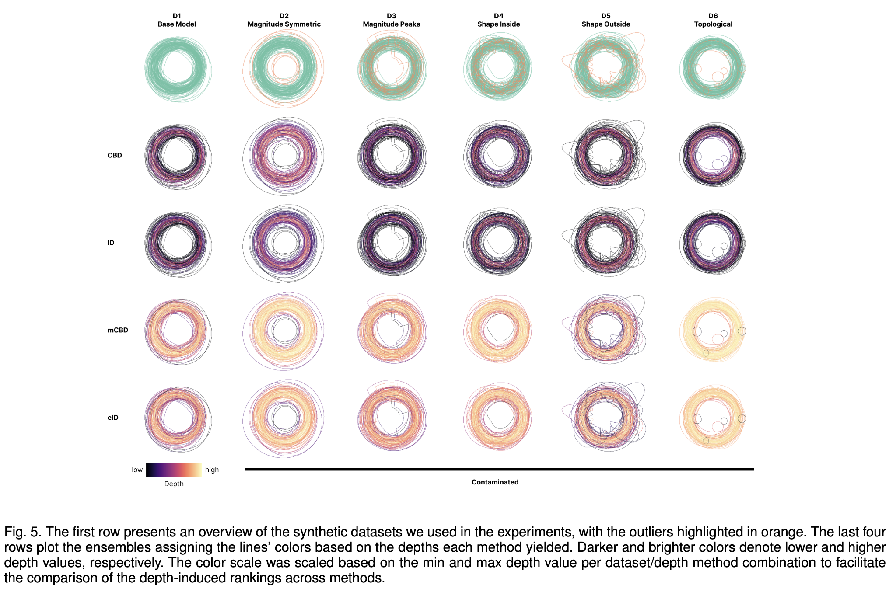

# Inclusion Depth for Contour Ensembles

[](https://opensource.org/licenses/MIT)

Code for the paper [Inclusion Depth for Contour Ensembles](https://ieeexplore.ieee.org/document/10381751).

This repository contains the code for the paper:
> N. F. Chaves-de-Plaza, P. Mody, M. Staring, R. van Egmond, A. Vilanova and K. Hildebrandt, "Inclusion Depth for Contour Ensembles," in IEEE Transactions on Visualization and Computer Graphics, doi: 10.1109/TVCG.2024.3350076.



If you use our code in your publications, please consider citing:
```
@article{chavesdeplaza2024inclusiondepth,
  author={Chaves-de-Plaza, Nicolas F. and Mody, Prerak and Staring, Marius and van Egmond, René and Vilanova, Anna and Hildebrandt, Klaus},
  journal={IEEE Transactions on Visualization and Computer Graphics}, 
  title={Inclusion Depth for Contour Ensembles}, 
  year={2024},
  volume={},
  number={},
  pages={1-12},
  keywords={Data visualization;Visualization;Uncertainty;Feature extraction;Data models;Computational modeling;Semantic segmentation;Uncertainty visualization;contours;ensemble summarization;depth statistics},
  doi={10.1109/TVCG.2024.3350076}
}
```

Also, consider checking our [extension of inclusion depth to multimodal contour ensembles](https://graphics.tudelft.nl/paper-multimodal-contour-depth). And, if you want to integrate contour depth in your project, check out the [`contour-depth` Python package](https://graphics.tudelft.nl/contour-depth).

## Setup

1. Install a conda (we recommend using [miniconda](https://docs.conda.io/projects/miniconda/en/latest/))
2. Create environment: `conda create --name=inclusion-depth python=3.9.16`
3. Activate environment: `conda activate inclusion-depth`
4. Install dependencies with pip: `pip install -r requirements.txt`
5. To test installation, from the root of the repository run `python -c "from src.depths.inclusion_depth import compute_depths"`. No errors should be raised.

## Replicating the paper results

The scripts in the `experiments` directory permit replicating the paper's results.
The prefixes `sd` and `rd` denote synthetic data and real data experiments. `sd_exp_data.py` generates data for `sd` experiments. The files `sd_res_*` generate the figures and tables in the paper.
The real data is available from the authors upon request. 

## License and third-party software
The source code in this repository is released under the MIT License. However, all used third-party software libraries are governed by their own respective licenes. Without the libraries listed in `requirements.txt`, this project would have been considerably harder.
